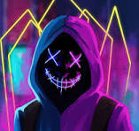
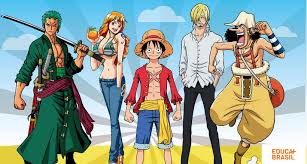
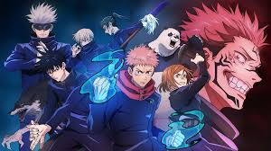
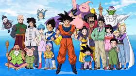

<div align="center">

# 💀⚡ Portfólio Cyber Anime

Um portfólio moderno com **HTML + CSS**, inspirado em estética **cyberpunk / anime / neon**.



---

✨ Design dark  
💙 Efeitos neon  
📱 Responsivo  
⚡ Interface moderna  

</div>

---

## 🌌 Sobre o projeto

Este é um portfólio pessoal criado para praticar **HTML e CSS**, com foco em:

- Design moderno
- UI escura (dark mode)
- Organização de seções
- Experiência visual imersiva

---

## 🧠 Tecnologias utilizadas

<div align="center">

| Tecnologia | Descrição |
|-----------|----------|
| HTML5 | Estrutura do site |
| CSS3 | Estilização completa |
| Flexbox | Layout responsivo |
| Media Queries | Adaptação mobile |

</div>

---

## 🎨 Estilo visual

O projeto segue uma identidade visual baseada em:

- 🌑 Fundo escuro profundo
- 💙 Azul neon
- 💜 Roxo glow
- ✨ Efeitos de brilho e hover
- 🧊 Cards com transparência (glass effect)

---

## 📸 Projetos

<div align="center">

### 🌊 One Piece


Um anime cheio de aventuras e muito popular no mundo todo.

---

### ⚔️ Jujutsu Kaisen


Lutas intensas contra maldições com animação de alto nível.

---

### 🔥 Dragon Ball


Clássico absoluto da cultura anime com batalhas épicas.

</div>

---

## 📂 Estrutura do projeto

```bash
📁 portfolio/
 ┣ 📁 img/
 ┃ ┣ primeira.jpg
 ┃ ┣ segunda.jpg
 ┃ ┣ terceira.jpg
 ┃ ┗ quarta.jpg
 ┣ index.html
 ┣ styles.css
 ┗ README.md
```
🚀 Funcionalidades
📌 Menu fixo com navegação suave
🧑‍💻 Seção “Sobre mim”
🎴 Cards de projetos estilizados
📬 Formulário de contato
🌈 Efeitos neon modernos
📱 Totalmente responsivo
👤 Autor
�.

Hack Nick
📌 Desenvolvedor Front-End em evolução
💀 Criador de projetos visuais cyber/anime
